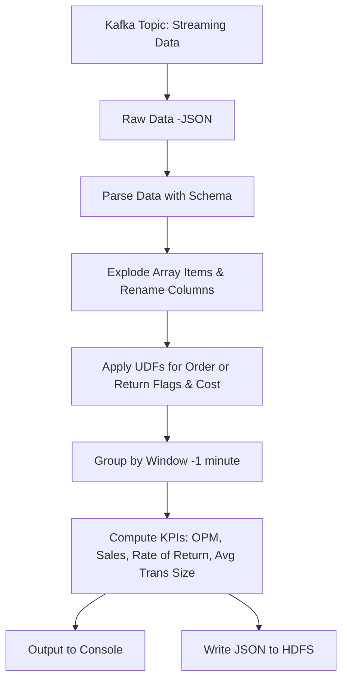

# Spark Streaming KPI Processing 🚀📊

[](https://spark.apache.org/) [](https://kafka.apache.org/) [](https://www.python.org/) [](LICENSE)

**Spark Streaming KPI Processing** is a real-time data processing application built using Apache Spark Streaming. The application ingests streaming data from Kafka, transforms it through custom user-defined functions (UDFs), and computes key performance indicators (KPIs) such as Orders per Minute, Total Sales Volume, Rate of Return, and Average Transaction Size. Processed results are output both to the console and to HDFS as JSON files for downstream analytics.

---

## 📖 Table of Contents

- [Overview](#overview)
- [Key Features](#key-features)
- [Project Architecture](#project-architecture)
- [Flow Diagram](#flow-diagram)
- [Technologies Used](#technologies-used)
- [Project Structure](#project-structure)
- [Installation & Setup](#installation--setup)
- [Usage](#usage)
- [Call-to-Action](#call-to-action)
- [License](#license)
- [Acknowledgements](#acknowledgements)

---

## 🔍 Overview

This project demonstrates a step-by-step Spark Streaming application to achieve real-time KPI calculations. The workflow includes:
- **Data Ingestion:** Reading streaming data from a Kafka topic.
- **Data Parsing:** Converting raw JSON messages into a structured DataFrame using a defined schema.
- **Data Transformation:** Unnesting array fields, renaming columns, and applying UDFs to calculate cost and flag order/return events.
- **KPI Calculation:** Aggregating data in 1-minute windows to compute metrics like Orders per Minute (OPM), Total Sales Volume, Rate of Return, and Average Transaction Size.
- **Output:** Streaming processed data to the console and writing JSON files to HDFS for both time-based and country-based KPIs.

---

## ✨ Key Features

- **Real-Time Data Ingestion:** Connects to Kafka for live data streaming.
- **Structured Data Processing:** Utilizes Spark Structured Streaming with a defined schema to make raw data readable.
- **Custom Transformations:** Implements UDFs to flag orders/returns and calculate transaction cost.
- **Windowed Aggregation:** Computes KPIs over 1-minute intervals with watermarking for late data.
- **Multiple Output Modes:** Streams output to the console and writes KPI data to HDFS as JSON.

---

## 🏗️ Project Architecture

The application is structured to ensure modularity and scalability. Key steps include:
1. **Library Import & Spark Session Setup**
2. **Kafka Connection & Data Ingestion**
3. **Schema Mapping & JSON Parsing**
4. **Exploding Array Columns & Renaming**
5. **Applying UDFs for KPI Derivation**
6. **Windowed Aggregation for KPI Calculation**
7. **Output Streaming to Console and HDFS**

---

## 🔄 Flow Diagram



---

## 🛠️ Technologies Used

<div align="center">
  <a href="https://spark.apache.org/">
    
  </a>
  <a href="https://kafka.apache.org/">
    
  </a>
  <a href="https://www.python.org/">
    
  </a>
  <a href="https://hadoop.apache.org/">
    
  </a>
</div>

---


## 💻 Installation & Setup

### Prerequisites

- **Python 3.8+**
- **Apache Spark 3.x**
- **Kafka Broker Access**
- **HDFS Setup** (for output files)
- **JDK Installed** (if using spark-submit)

### Setup Steps

1. **Clone the Repository:**

   ```bash
   git clone https://github.com/DadaNanjesha/Spark-streaming.git
   cd Spark-streaming
   git checkout dev
   ```

2. **Set Up Virtual Environment:**

   ```bash
   python -m venv venv
   source venv/bin/activate  # Windows: venv\Scripts\activate
   ```

3. **Install Dependencies:**

   Ensure your `requirements.txt` (if provided) includes necessary libraries like `pyspark`. Then run:

   ```bash
   pip install -r requirements.txt
   ```

4. **Configure Kafka & HDFS Settings:**

   - Update Kafka broker address, topic name, and any output paths in `spark-streaming.py`.

5. **Build the Application (Optional):**

   To create a jar for deployment, follow instructions in the code documentation:
   ```bash
   wget https://ds-spark-sql-kafka-jar.s3.amazonaws.com/spark-sql-kafka-0-10_2.11-2.3.0.jar
   export SPARK_KAFKA_VERSION=0.10
   spark2-submit --jars spark-sql-kafka-0-10_2.11-2.3.0.jar spark-streaming.py > console_print
   ```

---

## 🚀 Usage

- **Run Streaming Application:**  
  Execute the main Python file to start the streaming job:
  ```bash
  python spark-streaming.py
  ```
  
- **Monitor the Output:**  
  View real-time outputs in the console and monitor the Spark UI (default port 4040).

- **Review KPI Outputs:**  
  Processed KPIs will be written to HDFS directories as JSON files (paths as configured).

---

## ⭐️ Support & Call-to-Action

If you find this project useful, please consider:
- **Starring** the repository ⭐️
- **Forking** the project to contribute enhancements
- **Following** for updates on future improvements

Your engagement helps increase visibility and encourages further collaboration!

---

## 📜 License

This project is licensed under the [MIT License](LICENSE).

---

## 🙏 Acknowledgements

- **UpGrad Education:** For providing guidance and educational resources.
- **Apache Spark & Kafka Community:** For their open-source contributions.

---

*Happy Streaming & KPI Calculations! 🚀📡*
